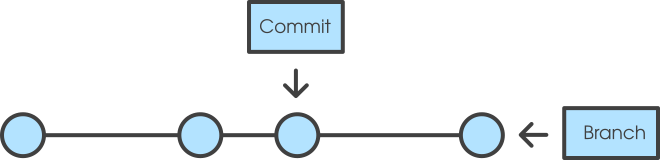

```{r dsetup, results = "hide", echo = FALSE, message = FALSE}
knitr::opts_chunk$set(
  fig.align='center',
  tidy=FALSE,
  comment="R>> ",
  size = 'small'
)
```

# What is Git?

## Git: a Control Version System (CVS)

- Design to track plain text files through a history

### Several key notions to understand:



## Key concept: Difference between local vs distant

- Git **is not Github or GitLab**
- Git is a software installed on your computer
- Github and Gitlab are services backing up your local history
- Local history (on your computer) vs remote history (on distant server)


# The standard workflow

## Initialize my folder with Git

### Aim: Start to track my changes in my proposal folder

```bash
mkdir my-new-repo ## Create a new folder
cd my-new-repo ## Move inside my new folder
git init ## Initialize ma folder as a git folder
```

Then, I start to write and save files in my folder...

### Question 1: Can I track changes of my MS Word file with git?

## Add a new file in my folder

```bash
touch proposal.md ## Create a new file inside my folder
git add proposal.md ## Tell git to track this new file
git commit -m "Add my description file" ## Commit the creation of this new file
```

## Write a new section in my file

1. Open the file with your favorite editor
2. Add a new section
3. go back to your terminal

**Question 2:** If I want to tell `git` to take in account these new changes, what I is the procedure?

**Tricks:** Type `git status` and take the time to read. `git status` is your friend

## Sync my changes with the remote server

1. Open our [Gitlab webpage](https://depot.ielab.usherbrooke.ca/)
2. Open a new project - Will can you help here ;)
3. Follow the procedure - Section **Existing folder**

### Pay attention to the line:

```
git remote add origin git@depot.ielab.usherbrooke.ca:viss2501/my_proposal.git
```

This is a configuration step, so it's only needed once...

## `Git push`

```bash
git push -u origin master
```

`Git push` is sending the commit to the remote server.

### When the origin/remote server has been defined:

`git push` is sending the changes to the remote server

**Suggestion:** Open the [Gitlab webpage](https://depot.ielab.usherbrooke.ca/) to see if the commits are now on the server.

# Live example with `git log`

## In summary

### Three command lines to remember:

1. `git add path/to/the/file` or `git add -A` for lazy people like me  
Tell **git** to track the file **OR the changes made on the files**
2. `git commit -m "my comments on the edits or new files"`
3. `git push` is sending the comments to the remote server (in our case GitLab)

**Note:** specify `origin master` is not always mandatory. It's set by default.

# Live example with `git lfs`
